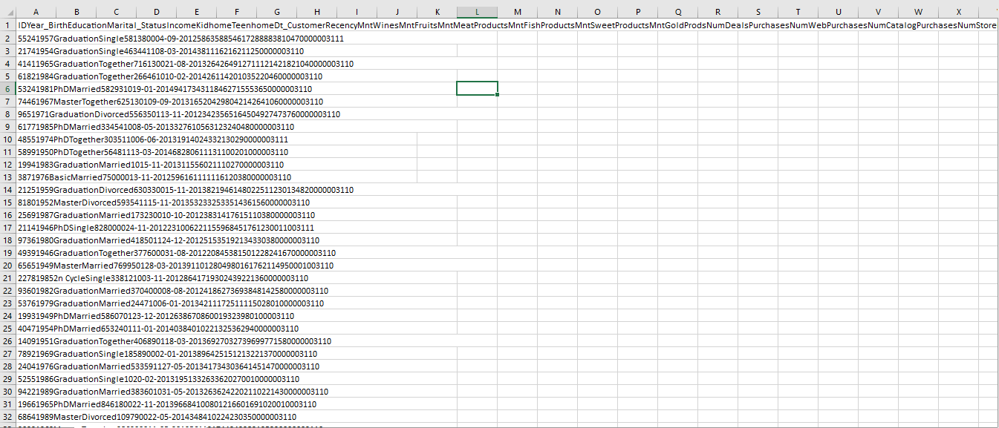
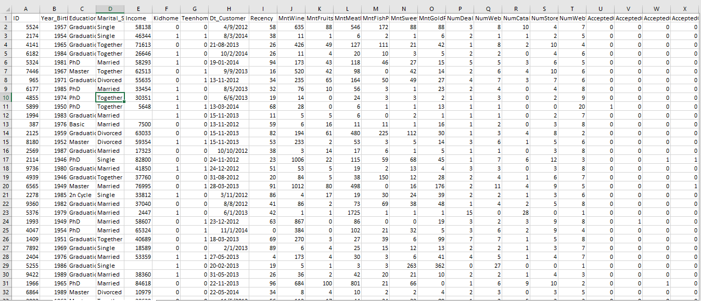
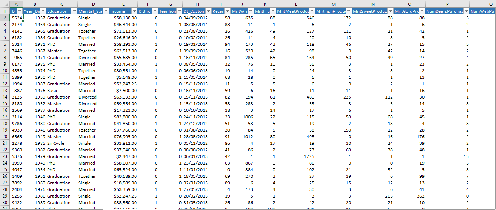

# 📊 Marketing Campaign Data Cleaning & Preparation(Excel)

## 🔹 Project Overview
Raw data is rarely useful in its original form. Businesses often struggle with messy, inconsistent datasets that make analysis difficult and unreliable.

In this project, I transformed a **raw marketing campaign dataset from Kaggle** into a clean, structured, and analysis-ready format using Microsoft Excel.

This project demonstrates my ability to **prepare real-world data for decision-making**, which is a critical first step in any data analysis workflow.

---

## 🔍 The Problem
The dataset initially had several issues:

- Data stored in a **single column (comma-separated format)**
- **Inconsistent formatting**
- Missing numerical values
- Unstructured date formats
- Extra/unnecessary columns
- Text inconsistencies (spaces, formatting errors)

👉 In this state, the data was **not usable for analysis or reporting**

---

## 🛠️ What I Did (Data Cleaning Process)

### ✅ Data Structuring
- Split the dataset into proper columns using **Text-to-Columns**
- Ensured each variable had its correct column

### ✅ Data Cleaning
- Removed irrelevant/unnecessary columns
- Handled missing values by filling numerical columns with **column averages**
- Used **TRIM function** to remove extra spaces
- Applied **IF statements** to standardize and correct values

### ✅ Data Formatting
- Converted columns to appropriate data types:
  - Dates → Proper date format  
  - Numerical fields → Number format  

### ✅ Final Touch
- Cleaned and organized the dataset for readability and usability
- Ensured the dataset is ready for **analysis, dashboards, or reporting**

---

## 📈 Project Outcome

✔ Clean, structured dataset  
✔ Ready for analysis and visualization  
✔ Improved data reliability  
✔ Business-ready format  

This cleaned dataset can now be used to:
- Analyze customer behavior  
- Track spending patterns  
- Build dashboards  
- Generate business insights  

---

## 📊 Dataset Description

The dataset contains customer-related information such as:

- Demographics (Year of Birth, Education, Marital Status)
- Income levels
- Spending behavior (Wines, Fruits, Meat, etc.)
- Purchase channels (Web, Store, Catalog)
- Customer engagement (Recency, Campaign responses)

---

## 🖼️ Project Screenshots

### 🔹 Raw Data (Before Cleaning)

---

### 🔹 Data After Splitting Columns

---

### 🔹 Cleaned Dataset

---

## 💡 Key Skills Demonstrated

- Data Cleaning  
- Data Transformation  
- Excel Functions (TRIM, IF, AVERAGE)  
- Data Formatting  
- Problem-Solving with Real-world Data  

---

## 🚀 Why This Project Matters

Many businesses lose valuable insights because their data is messy.

This project shows that I can:
- Take **raw, unusable data**
- Transform it into a **clean, structured asset**
- Prepare it for **analysis and decision-making**

---

## 📬 Contact Me

- 📧 Email: chiderajohn519@gmail.com
- 💼 LinkedIn: https://www.linkedin.com/in/john-chidera-osi-0b6b55319/  

---

## 🔗 Project Link
https://github.com/Osi-Chidera-John/Marketing-Campaign-Data-Cleaning-Preparation-Excel-/blob/main/marketing_campaign_Project.xlsx

---

## 🔥 Final Note

Clean data is the foundation of every great dashboard, report, or business decision.

This project reflects my ability to ensure that foundation is **solid, reliable, and analysis-ready**.
